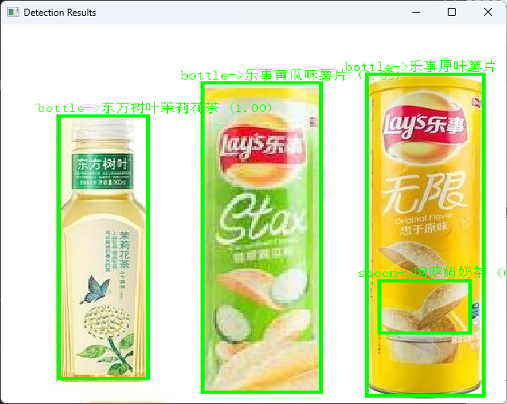

# YOLO_CLIP_targetDetection

**描述**：基于YOLO和CLIP的物体检测和细类分类项目。

**写在前面**:本项目的测试和直接调用的文件是`test_YOLO.py`和`test_YOLO_video.py`，这两个文件分别用于图像和视频的检测和分类。具体的使用方法参考4.2和4.3。

## 1. 项目简介
本项目结合了YOLO和CLIP模型的优点，用于图像和视频中的目标检测和细类分类。首先，使用YOLO对图像中的物体进行初步检测并生成候选区域，然后利用CLIP模型对这些候选区域进行细致的类别分类。该项目适用于需要精准分类的物体检测任务，例如超市商品分类或特定物体识别。

## 2. 项目结构(持续更新)

```plaintext
YOLO_CLIP_targetDetection
│
├── clip_model/                          # CLIP模型相关文件
├── dataset/                             # 原始数据集目录
│
├── pure_dataset_test/                   # 处理后的纯净数据集
│   ├── after/                           # 包含裁剪后的图像
│   ├── pre/                             # 原始图像
│   └── split_dataset/                   # 分割后的数据集
│       ├── train/
│       ├── val/
│       └── test/
│
├── wds_dataset/                         # WebDataset格式的数据集
│
├── CLIP_fine_tune_test.py               # CLIP模型微调脚本
├── create_pure_dataset_jsonStyle.py     # 将原始数据集转换为纯净数据集格式
├── FenGeShuJuJi.py                      # 数据集分割脚本
├── dataset_pre-treatment.py             # 将数据集转换为WebDataset格式
├── test_YOLO.py                         # 图像检测和分类脚本
├── test_YOLO_video.py                   # 视频检测和分类脚本
└── README.md                            # 项目说明文件
```

### 关键文件介绍
- **test_YOLO.py**：针对单张图像的目标检测和细类分类脚本。
- **test_YOLO_video.py**：用于视频流中的实时检测和细类分类。
- **CLIP_fine_tune_test.py**：微调CLIP模型的脚本，以适应特定类别的检测需求。
- **create_pure_dataset_jsonStyle.py**：处理原始数据集，生成裁剪后的目标区域图像。
- **FenGeShuJuJi.py**：将数据集分割为训练集、验证集和测试集。
- **dataset_pre-treatment.py**：将分割后的数据集打包为 WebDataset 格式，提高数据加载效率。

## 3. 环境与依赖

- **Python 3.9+**
- **PyTorch**
- **YOLOv10**：使用 `ultralytics` 库。
- **open-CLIP**
- **WebDataset**：用于高效的数据集打包和加载。

### 安装依赖
注意：本项目使用的是经过微调的open-clip模型，而非openAI官网的CLIP

```bash
pip install open_clip_torch
```

## 4. 使用说明

### 1. 训练和微调CLIP模型
使用 `CLIP_fine_tune_test.py` 对CLIP模型进行微调，使其能够更好地识别特定类别。

**注：代码中已经准备好数据集，可以直接运行代码进行CLIP微调，训练好的模型权重文件保存在根目录下。**

```bash
python CLIP_fine_tune_test.py
```
已经微调好的示例模型可以在下面这个链接下载：
链接：https://pan.baidu.com/s/1l_MBAu2RwivtJNd4TwdLlQ?pwd=wts0 
提取码：wts0

### 2. 图像检测
运行 `test_YOLO.py` 对单张图像进行目标检测和细类分类。将检测到的物体类别和细分类别显示在图像上。

**注：test_YOLO.py的具体使用方法可以查看test_README.md文件**

```bash
python test_YOLO.py
```

### 3. 视频检测
该部分还没有进行具体的测试，后续会更新，建议先使用图像检测。
使用方法为：

运行 `test_YOLO_video.py` 对视频流进行实时目标检测和细类分类。将检测结果实时显示在视频帧上。

```bash
python test_YOLO_video.py
```

## 5. 示例结果

以下是项目运行的示例结果：

- **图像检测结果**：


- **视频检测结果**：


## 6. 数据集准备

### 1. 数据预处理
使用 `create_pure_dataset_jsonStyle.py` 脚本对原始数据集进行处理，将标注的物体裁剪为单独的图像文件，便于后续分类和训练。

```bash
python create_pure_dataset_jsonStyle.py
```

### 2. 数据集分割
使用 `FenGeShuJuJi.py` 脚本将裁剪后的数据集分割为训练集、验证集和测试集，默认分割比例为80%训练，15%验证，5%测试。

```bash
python FenGeShuJuJi.py
```

### 3. 转换为 WebDataset 格式
使用 `dataset_pre-treatment.py` 脚本将分割后的数据集打包为 WebDataset 格式，以提高数据加载效率。

```bash
python dataset_pre-treatment.py
```

